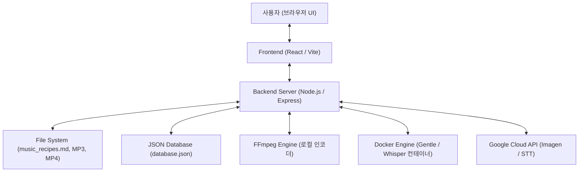

# Product Architecture

---
document_id: PROD-ARCH
title: Product Architecture
title_ko: 제품 아키텍처
project: lyrify
profile: product
gate_scope: gate2
status: Draft
version: v0.2
owner_role: Product Architect
author: Agent
reviewer: User
approver: User
created_at: 2026-07-08
updated_at: 2026-07-08
related_documents:
  - docs/product/PRODUCT_BRIEF.md
  - docs/product/ADR_LOG.md
---

## 1. Architecture Overview

## 2. Components

| Component ID | 이름 | 책임 | 주요 계약 | 관련 Scenario |
| --- | --- | --- | --- | --- |
| CMP-001 | File Watcher & Parser | `music_recipes.md` 파일 변경 감지 및 곡별 메타데이터/가사 파싱 | 로컬 파일 감시 및 파서 알고리즘 | SCN-001 |
| CMP-002 | Audio Mapping Manager | 로컬에 보관된 ACE-Step 초안 및 릴리아 최종 MP3 파일을 매핑 및 저장 | API-002, database.json 갱신 | SCN-002 |
| CMP-003 | Thumbnail Generator | Google Imagen API 연동 또는 로컬 템플릿(Canvas/SVG)을 사용한 썸네일 커버 합성 | API-004, 로컬 파일 쓰기 | SCN-003 |
| CMP-004 | Video Encoder (FFmpeg) | FFmpeg를 호출하여 음원 + 다중 슬라이드 이미지 + 자막을 합성하여 MP4로 인코딩 | API-005, 로컬 FFmpeg 제어 | SCN-004 |
| CMP-005 | Sync Editor | 브라우저 UI에서 가사 파트별 타임라인 시작 시점(초)을 수동 기입/미세 조정 | API-003, 프론트엔드 UI | SCN-004 |
| CMP-006 | AI Sync Client | Docker 기반 로컬 API(Gentle) 또는 Google STT API를 연동하여 자동 가사 정렬(Forced Alignment) 수행 | API-006, HTTP API 클라이언트 | SCN-004 |

## 3. Runtime And Deployment Assumptions

| 항목 | 기준 |
| --- | --- |
| Runtime | Node.js v18+ (Backend), Modern Web Browser (Frontend, React/Vite 빌드 결과물 구동) |
| Data Store | 로컬 JSON 기반 경량 파일형 데이터베이스 (`database.json`) |
| External Integration | 1. Docker 데몬 및 Gentle/Whisper 로컬 API 서버 (`http://localhost:8765`) - 선택 사항 2. Google Cloud Platform API (Imagen / Speech-to-Text) - 선택 사항 |
| Deployment Target | 로컬 크리에이터 PC (단일 사용자 로컬 웹 애플리케이션 환경) |
| Observability | Node.js 로컬 콘솔 로그 및 FFmpeg 인코딩 stderr 진행 상황 파이프 출력 로그 |

## 4. Security Design Baseline

Product profile의 기본 보안 기준은 `docs/core/PRODUCT_PROFILE_BASELINE.md`와 `docs/core/SECURITY_BASELINE.md`를 따른다.
제품 릴리즈에 영향을 주는 보안 결정을 이 표에서 명시한다.

| Security Area | 결정/정책 | 적용 위치 | 검증/증적 |
| --- | --- | --- | --- |
| Authentication | 로컬 단일 사용자 환경이므로 별도의 웹 기반 로그인 인증은 생략함. | 해당없음 (로컬 웹앱) | 해당없음 |
| Authorization | 로컬 호스트 루프백 포트 바인딩으로 로컬 사용자 권한에 의존함. | `server.js` (Express 포트 바인딩) | SEC-REG-001 |
| Input Validation | 감시 디렉토리 및 파일명 매핑 시 경로 트래버스 취약점 차단 검증. | `CMP-001 (Parser)`, `API-002` | SEC-REG-001 |
| Data Protection | Google GCP API Key는 비공개 저장 및 소스 커밋 저장소에서 영구 배제. | `.env` 또는 `config.json` 로컬 설정 | SEC-REG-001 |
| Error And Logging | 비디오 인코딩 및 파일 스캔 실패 시 스택 정보의 화면 노출 제한. | Express 예외 필터 및 로그 파일 모듈 | SEC-REG-001 |
| Web/API Risk | 로컬 루프백(`127.0.0.1`) 포트 격리 바인딩 및 CORS 차단으로 외부 인젝션 원천 차단. | `server.js` (Express 설정) | SEC-REG-001 |
| Secrets And Config | API Key 등의 보안 토큰은 `.gitignore`에 등록하여 GitHub 유출 방지. | `.gitignore`, `.env` | SEC-REG-001 |
| Dependency Risk | FFmpeg 바이너리 유효성 검사 및 정적 패키지 락파일 잠금으로 신뢰성 확보. | `package-lock.json`, `CMP-004` | SEC-REG-001 |

## 5. Quality Attributes

| 품질속성 | 기준 | 검증 방법 |
| --- | --- | --- |
| Reliability | 1. 이미지 API 실패 시에도 로컬 그라데이션 합성 배경 템플릿으로 썸네일 정상 생성. 2. 파일 감시 중 파일 잠금(Lock) 충돌 발생 시 예외 처리 및 재시도 메커니즘 제공. | 단위 테스트 및 강제 API 에러 주입 테스트 |
| Security | 1. 구글 GCP API Key 등 비공개 자격증명은 로컬 `.env` 파일에만 보관하고 소스 저장소 커밋에서 제외. 2. 로컬 경로 트래버스 취약점 방지를 위해 대상 폴더 외부 경로 접근 차단. | docs/core/SECURITY_BASELINE.md 기반 정적 코드 분석 |
| Maintainability | 비디오 렌더링(FFmpeg)과 AI 분석(STT/Docker) 관련 모듈을 인터페이스 경계로 분리하여 로컬 AI 엔진 변경 시 유연하게 교체 가능하게 설계. | 컴포넌트 경계 인터페이스 검토 |

## 6. Architecture Gaps

| Gap ID | 내용 | 영향 | 후속 판단 |
| --- | --- | --- | --- |
| GAP-001 | 사용자 PC 사양에 따른 비디오 인코딩 및 AI 로컬 연산 병목 위험 | GPU 미지원 환경이나 저사양 CPU 탑재 PC에서 인코딩 시간이 극도로 길어질 수 있음 | 개발표준에서 FFmpeg 인코딩 가속 옵션(인텔 QSV, 엔비디아 NVENC 등) 설정을 선택할 수 있게 확장 검토 |
