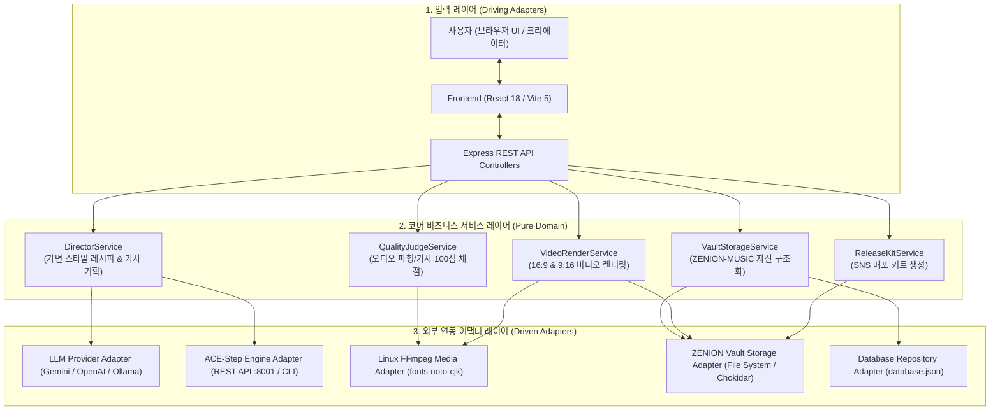

# Product Architecture

---
document_id: PROD-ARCH
title: Product Architecture
title_ko: 제품 아키텍처
project: lyrify
profile: product
gate_scope: gate2
status: Draft
version: v0.3
owner_role: Product Architect
author: Agent
reviewer: User
approver: User
created_at: 2026-07-08
updated_at: 2026-08-27
related_documents:
  - docs/product/PRODUCT_BRIEF.md
  - docs/product/ADR_LOG.md
---

## 1. Architecture Overview (Hexagonal Architecture - Ports & Adapters)

```mermaid
flowchart TD
  subgraph Driving_Adapters ["1. 입력 레이어 (Driving Adapters)"]
    User["사용자 (브라우저 UI / 크리에이터)"] <--> FE["Frontend (React 18 / Vite 5)"]
    FE <--> ExpressRouter["Express REST API Controllers"]
  end

  subgraph Core_Services ["2. 코어 비즈니스 서비스 레이어 (Pure Domain)"]
    DirectorSvc["DirectorService<br>(가변 스타일 레시피 & 가사 기획)"]
    JudgeSvc["QualityJudgeService<br>(오디오 파형/가사 100점 채점)"]
    VaultSvc["VaultStorageService<br>(ZENION-MUSIC 자산 구조화)"]
    RenderSvc["VideoRenderService<br>(16:9 & 9:16 비디오 렌더링)"]
    ReleaseSvc["ReleaseKitService<br>(SNS 배포 키트 생성)"]
  end

  subgraph Driven_Adapters ["3. 외부 연동 어댑터 레이어 (Driven Adapters)"]
    LLMAdapter["LLM Provider Adapter (Gemini / OpenAI / Ollama)"]
    ACEAdapter["ACE-Step Engine Adapter (REST API :8001 / CLI)"]
    FFmpegAdapter["Linux FFmpeg Media Adapter (fonts-noto-cjk)"]
    StorageAdapter["ZENION Vault Storage Adapter (File System / Chokidar)"]
    DBAdapter["Database Repository Adapter (database.json)"]
  end

  ExpressRouter --> DirectorSvc & JudgeSvc & VaultSvc & RenderSvc & ReleaseSvc
  DirectorSvc --> LLMAdapter & ACEAdapter
  JudgeSvc --> FFmpegAdapter
  VaultSvc --> StorageAdapter & DBAdapter
  RenderSvc --> FFmpegAdapter & StorageAdapter
  ReleaseSvc --> StorageAdapter
```

## 2. Components

| Component ID | 이름 | 책임 및 구현 레이어 | 주요 계약 | 관련 Scenario |
| --- | --- | --- | --- | --- |
| CMP-001 | AI Music Director (`DirectorService`) | 가변 곡 수(1~20곡) 및 3대 기획 모드(`explore`, `single`, `album`) 지원, Gemini SDK Structured Outputs(JSON) 기반 스타일/가사 기획 및 ACE REST API/CLI 트리거 | API-001 | SCN-001 |
| CMP-002 | Quality Screening & Evaluator (`QualityJudgeService`) | ACE 초안의 오디오 파형(클리핑/무음) 및 가사 구조를 100점 만점으로 자동 채점 및 랭킹 정렬 | API-003 | SCN-002 |
| CMP-003 | File Watcher & ZENION Storage Manager | `music_recipes.md` 감시 및 `ZENION-MUSIC` 폴더 내 곡별 자산(음원, 가사, 커버, 메타데이터) 자동 구조화 관리 | API-002, API-004 | SCN-002, SCN-003 |
| CMP-004 | Thumbnail & Visual Generator | Google Imagen API 연동 또는 로컬 그라데이션 템플릿 기반 썸네일 커버 합성 | API-005 | SCN-004 |
| CMP-005 | Multi-Format Video Encoder | 로컬 FFmpeg를 제어하여 유튜브 롱폼(16:9) 및 인스타/틱톡 숏폼(9:16) 가사 비디오 렌더링 | API-006 | SCN-004 |
| CMP-006 | Release Kit Generator | 유튜브, 인스타그램, 틱톡 업로드 맞춤 제목, 설명문, 해시태그, 타임스탬프 가사 원클릭 생성 | API-007 | SCN-005 |
| CMP-007 | AI Sync Client | Docker Gentle API, Web Audio 또는 Google STT 연동 가사 타임라인 자동 정렬 | API-008 | SCN-004 |

## 3. Runtime And Deployment Assumptions

| 항목 | 기준 |
| --- | --- |
| OS & Container Base | **Linux (Debian 12 Bookworm 기반, `node:20-bookworm-slim`)** |
| Language & Runtime | **Node.js v20.x LTS (Backend/Express), React 18.x + Vite 5.x (Frontend)** |
| Media Processing Engine | **Linux 네이티브 FFmpeg v6.x+ (컨테이너 내 내장) + `fonts-noto-cjk` (한글 자막 폰트) + `libass` / `fontconfig`** |
| Data Store | 로컬 JSON 기반 경량 파일형 데이터베이스 (`database.json`) & `ZENION-MUSIC` 파일 시스템 |
| Docker Volume Mounts (마운트 포인트) | 1. **ZENION 저장소**: Host `C:\Users\julyi\Documents\ZENION-MUSIC` ↔ Container `/data/ZENION-MUSIC` 2. **ACE 초안 저장소**: Host `C:\Users\julyi\Documents\ACE-Step-1.5` ↔ Container `/data/ACE-Step-1.5` 3. **DB 및 설정**: Host `./data` ↔ Container `/app/data` 4. **환경 변수**: Host `.env` ↔ Container `/app/.env` |
| External Integration | 1. **AI 디렉터 LLM 엔진**: Google Gemini SDK (`@google/genai`) 기본 연동, OpenAI / Ollama 멀티 어댑터 지원 2. **ACE-Step-1.5 엔진 연동**: 로컬 REST API (`http://host.docker.internal:8001`) 및 백그라운드 CLI (`cli.py`) 하이브리드 트리거 3. **Docker 데몬 (선택)**: Gentle/Whisper 로컬 API (`http://localhost:8765`) 4. **Google Cloud Platform API**: Imagen / Speech-to-Text (선택 사항) |
| Deployment & Port | **Docker Compose 배포 (`docker compose up -d`)**, 웹 대시보드 포트: `5173:5173` (또는 `3000:3000`) |
| Observability | Node.js 로컬 콘솔 로그 및 FFmpeg 인코딩 stderr 진행 상황 파이프 출력 로그 |

## 4. Security Design Baseline

Product profile의 기본 보안 기준은 `docs/core/PRODUCT_PROFILE_BASELINE.md`와 `docs/core/SECURITY_BASELINE.md`를 따른다.
제품 릴리즈에 영향을 주는 보안 결정을 이 표에서 명시한다.

| Security Area | 결정/정책 | 적용 위치 | 검증/증적 |
| --- | --- | --- | --- |
| Authentication | 로컬 단일 사용자 환경이므로 별도의 웹 기반 로그인 인증은 생략함. | 해당없음 (로컬 웹앱) | 해당없음 |
| Authorization | 로컬 호스트 루프백 포트 바인딩으로 로컬 사용자 권한에 의존함. | `server.js` (Express 포트 바인딩) | SEC-REG-001 |
| Input Validation | 감시 디렉토리 및 `ZENION-MUSIC` 파일명 매핑 시 경로 트래버스 취약점 차단 검증. | `CMP-003 (Storage Manager)`, `API-004` | SEC-REG-001 |
| Data Protection | Google GCP API Key는 비공개 저장 및 소스 커밋 저장소에서 영구 배제. | `.env` 또는 `config.json` 로컬 설정 | SEC-REG-001 |
| Error And Logging | 비디오 인코딩 및 파일 스캔 실패 시 스택 정보의 화면 노출 제한. | Express 예외 필터 및 로그 파일 모듈 | SEC-REG-001 |
| Web/API Risk | 로컬 루프백(`127.0.0.1`) 포트 격리 바인딩 및 CORS 차단으로 외부 인젝션 원천 차단. | `server.js` (Express 설정) | SEC-REG-001 |
| Secrets And Config | API Key 등의 보안 토큰은 `.gitignore`에 등록하여 GitHub 유출 방지. | `.gitignore`, `.env` | SEC-REG-001 |
| Dependency Risk | FFmpeg 바이너리 유효성 검사 및 정적 패키지 락파일 잠금으로 신뢰성 확보. | `package-lock.json`, `CMP-005` | SEC-REG-001 |

## 5. Quality Attributes

| 품질속성 | 기준 | 검증 방법 |
| --- | --- | --- |
| Reliability | 1. 이미지 API 실패 시에도 로컬 그라데이션 합성 배경 템플릿으로 썸네일 정상 생성. 2. 파일 감시 중 파일 잠금(Lock) 충돌 발생 시 예외 처리 및 재시도 메커니즘 제공. | 단위 테스트 및 강제 API 에러 주입 테스트 |
| Security | 1. 구글 GCP API Key 등 비공개 자격증명은 로컬 `.env` 파일에만 보관하고 소스 저장소 커밋에서 제외. 2. 로컬 경로 트래버스 취약점 방지를 위해 `ZENION-MUSIC` 및 작업 폴더 외부 경로 접근 차단. | docs/core/SECURITY_BASELINE.md 기반 정적 코드 분석 |
| Maintainability | 비디오 렌더링(FFmpeg), AI 분석(Judge/Sync), AI 기획(Director) 모듈을 인터페이스 경계로 분리하여 독립 확장 가능하도록 설계. | 컴포넌트 경계 인터페이스 검토 |

## 6. Architecture Gaps

| Gap ID | 내용 | 영향 | 후속 판단 |
| --- | --- | --- | --- |
| GAP-001 | 사용자 PC 사양에 따른 비디오 인코딩(16:9 / 9:16) 병목 위험 | GPU 미지원 환경이나 저사양 CPU 탑재 PC에서 멀티 포맷 인코딩 시간이 길어질 수 있음 | 개발표준에서 FFmpeg 인코딩 가속 옵션(NVENC, QSV 등) 및 싱글/일괄 인코딩 선택 옵션 제공 |
